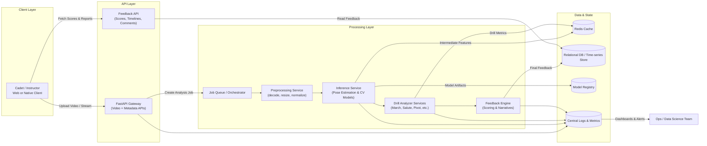
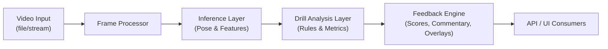

# DrillSight – Technical Showcase (Centific Hackathon)

DrillSight is a computer-vision powered drill analyzer for NCC-style marching drills and salutes. This repository is a **technical showcase** of the production architecture and MLOps mindset behind the project, while intentionally keeping the core ML models and proprietary analysis logic private.

> **Context:** Built for the Centific Hackathon (All-India Rank 4), DrillSight analyzes cadet drill videos and delivers objective, frame-level feedback on posture, timing, and synchronization.

---

## 1. Problem Statement

Traditional drill evaluation is:
- **Subjective:** Depends heavily on the individual judge’s experience and momentary perception.
- **Non-repeatable:** The same performance can receive different scores from different judges.
- **Offline & slow:** Feedback is mostly post-event, with limited frame-by-frame breakdown.
- **Non-quantitative:** Difficult to compare progress across time or between squads.

**Goal:**
Build a system that can **ingest drill videos** (march-past, salute, pivots, etc.), run **real-time computer vision analysis**, and provide **objective, explainable, and actionable feedback** to cadets and instructors.

Key requirements:
- Robust to varied backgrounds, camera angles, and lighting.
- Low-latency inference suitable for near real-time feedback.
- Clear feedback channels: per-cadet, per-frame, and per-metric.
- Architecture that is **deployable, observable, and maintainable** in production.

---

## 2. Solution Overview

At a high level, DrillSight consists of:
- A **FastAPI backend** exposing HTTP endpoints for video upload, drill configuration, and feedback retrieval.
- A **computer vision inference layer** (pose estimation, keypoint extraction, temporal modeling) abstracted behind service interfaces.
- A set of **drill analyzers** (e.g., March Past, Vishram–Savdhaan, Salute) that apply domain rules on top of model outputs.
- A **feedback engine** that converts raw analysis into scores, textual comments, heatmaps, and timelines.
- **MLOps and infra components** for experiment tracking, model versioning, deployment, and monitoring.

The core ML models and drill heuristics are private; this repo focuses on **system design, interfaces, and deployment patterns**.

---

## 3. System Architecture (High-Level)

The diagram below summarizes the end-to-end flow from a cadet’s device to feedback delivery and monitoring.



**Highlights:**
- **FastAPI gateway** keeps the external contract clean while allowing internal services to evolve.
- **Redis** is used for low-latency caching of intermediate features and computed metrics.
- **Model Registry** holds versioned models with metadata (training data slice, metrics, tags) without exposing implementation.
- **Centralized logging and metrics** enable observability and ops-friendly incident response.

---

## 4. Computer Vision Flow (Inference → Analysis → Feedback)

Conceptually, DrillSight’s computer vision flow is split into three distinct stages:

1. **Inference (Per-frame / Per-window)**
   - Decode video frames or short temporal windows.
   - Run **pose estimation / keypoint detection** and optionally temporal models.
   - Emit **structured outputs** like keypoints, confidences, bounding boxes, and derived features (stride length, arm angle, etc.).

2. **Analysis (Drill-specific logic)**
   - For each drill type (March Past, Salute, Vishram–Savdhaan, etc.):
     - Align keypoints over time to the drill script.
     - Compute metrics such as timing, alignment, synchronization, and posture correctness.
     - Flag rule violations with timestamps and relevant joints/limbs.
   - Aggregate into per-cadet and per-squad metrics.

3. **Feedback (Human-readable output)**
   - Map analysis events to **scores**, **textual comments**, and optional **visual overlays**.
   - Summarize in:
     - Per-drill report (e.g., total score, penalties, strengths).
     - Timeline of key events (e.g., “Right arm late by 200ms at 00:12.4”).
     - Exportable artifacts (JSON for API consumers; images/video for UX).

The flow below abstracts this pipeline without exposing the internal ML models:



---

## 5. MLOps & Production Pipeline (Conceptual)

DrillSight treats the ML lifecycle as a first-class engineering problem, not a notebook experiment.

**a. Data & Labeling**
- Ingest drill videos along with metadata (cadet, unit, drill type, conditions).
- Use structured schemas for raw, curated, and labeled datasets.
- Maintain strict train/validation/test splits and temporal leakage guards.

**b. Experiment Tracking & Versioning**
- Log experiments with hyperparameters, metrics, and artifacts (e.g., via MLflow / Weights & Biases).
- Version datasets and models to enable reproducible training.

**c. Training & Evaluation**
- Run training in isolated environments (containers) with fixed dependencies.
- Generate standardized evaluation reports by drill type.
- Gate model promotion on performance thresholds and fairness constraints.

**d. Model Packaging & Registry**
- Package models as versioned artifacts (e.g., `drillsight-march-v3`).
- Store along with metadata (schema version, training data slice, metrics, git SHA).
- Expose a consistent loading interface to the inference service.

**e. CI/CD for ML & API**
- Unit tests for non-ML code (API contracts, analysis interfaces, adapters).
- Integration tests that validate end-to-end flows with **mocked models**.
- Automated build & push of API images on main branch.
- Staged deployments (dev → staging → prod) with configuration-based routing.

**f. Online Monitoring & Feedback Loop**
- Collect latency, throughput, and error rates for each API endpoint.
- Track input data drift and performance proxies post-deployment.
- Enable canary or shadow deployments for new models.

---

## 6. Running Locally with Docker

This technical showcase includes a containerized FastAPI backend and Redis cache.

1. Ensure `requirements.txt` defines `fastapi`, `uvicorn`, and `redis` client libs.
2. Build and start the stack:

```bash
docker-compose up --build
```

3. The FastAPI app is exposed on `http://localhost:8000` and can be extended with:
   - `/health` for health checks.
   - `/analyze` for submitting drill analysis jobs.
   - `/feedback/{job_id}` for retrieving feedback.

(Endpoints are illustrative; you control the concrete API design.)

---

## 7. Repository Layout

See the companion document for the high-level repository layout and production mindset:

- [project_structure.md](project_structure.md)

This allows recruiters and reviewers to understand your architectural thinking without exposing the proprietary DrillSight ML core.

---

## 8. 🏆 Team & Recognition

- National Rank Top 6 / 85 – All-India NCC Idea Innovation Competition (2025).

## Team MemberCore Contributions

- Manish Kumar Choudhary: 
Lead AI & Systems Engineer: Architected the core CV pipeline using MediaPipe and OpenCV. Integrated the end-to-end data flow, handled model inference, and built the production-ready backend (FastAPI/Docker).

- Jaishree Gandhi
Product & Domain Lead: Designed the scoring algorithms and performance metrics. Developed the data visualization logic and frontend graphs. Provided domain expertise and led field implementation/testing.
